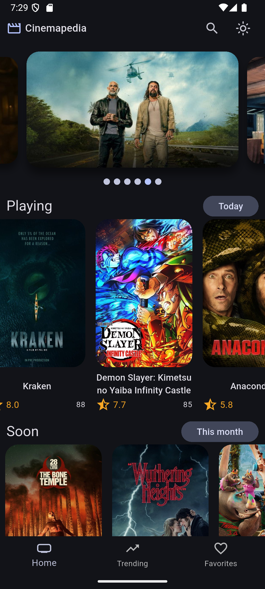
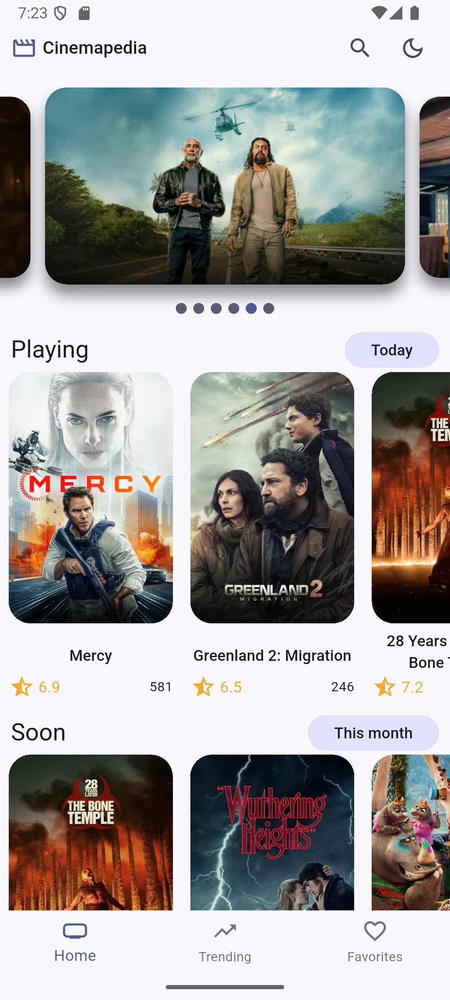
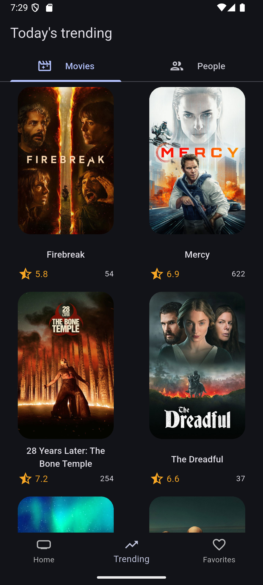
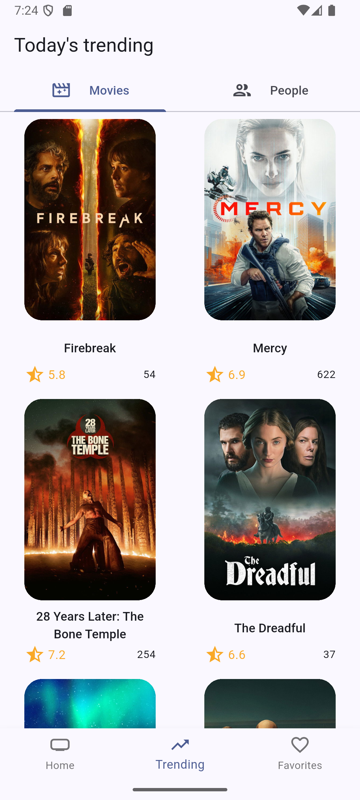
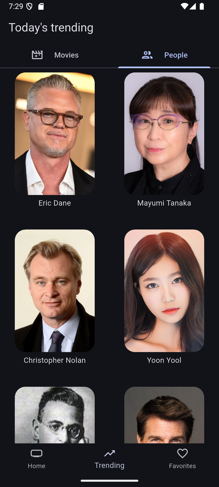
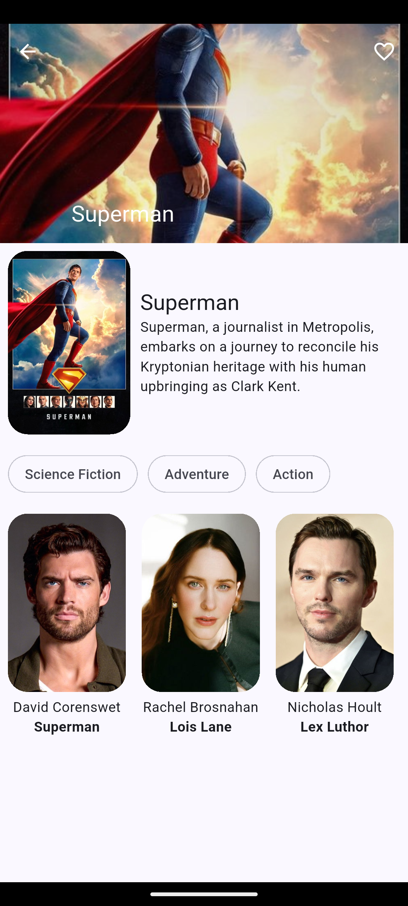
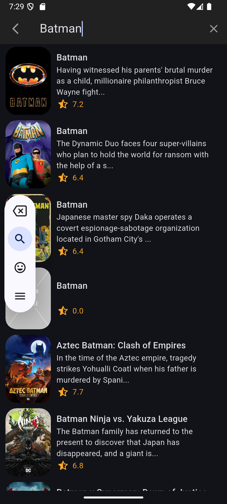
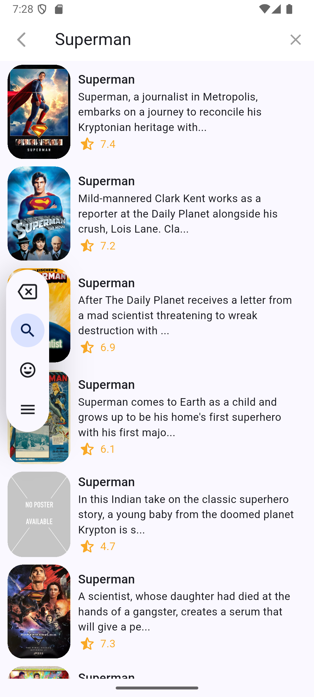
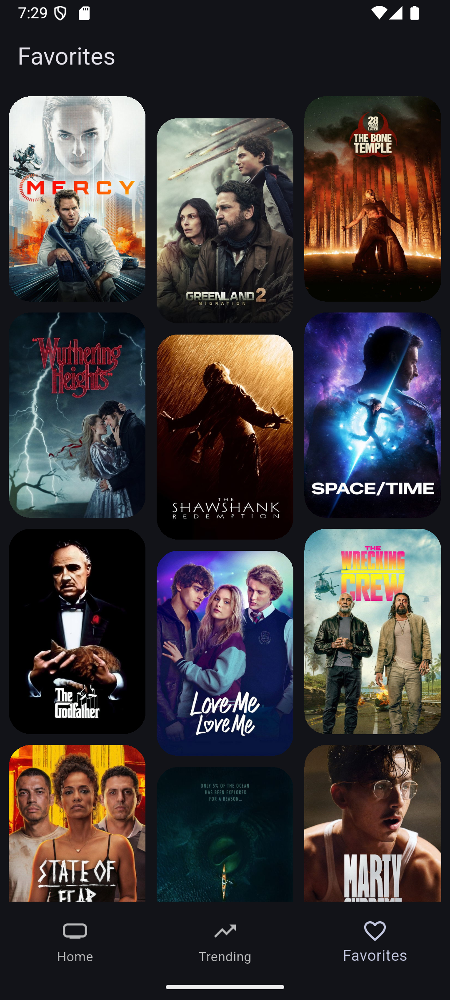
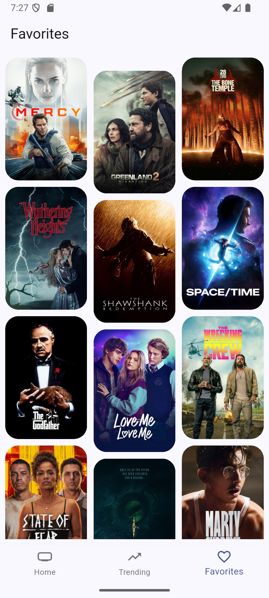

# cinemapedia

# Dev
1. Cambiar el nombre de .env.template a .env
2. Cambiar el API key de The Movie DB
3. Cambios en la entidad, se debe ejecutar el comando
`flutter pub run build_runner build`

# Screenshots

  
  
  
  
  
  
  
  
  
  
  

